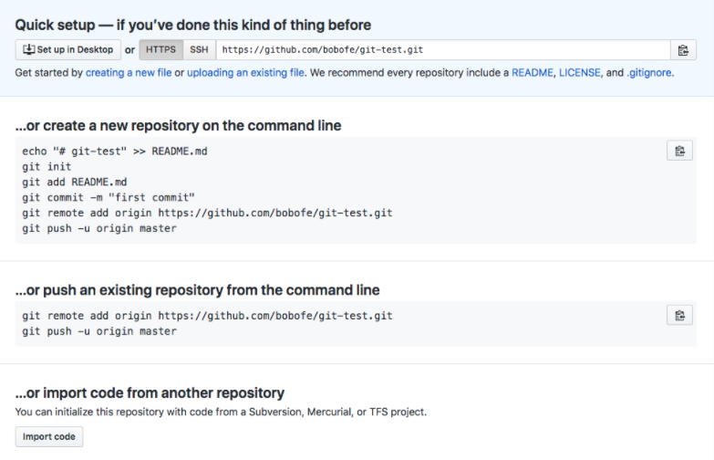
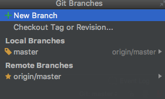
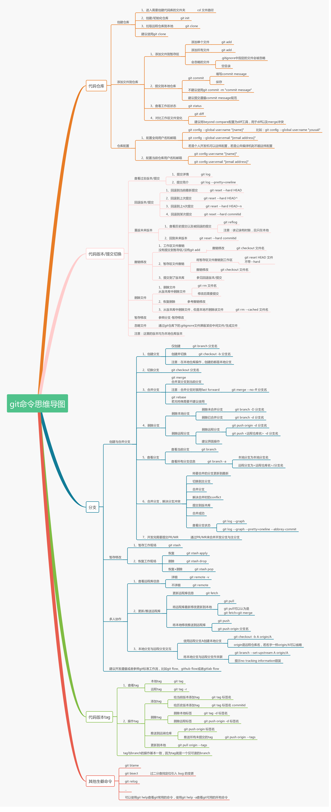

# git命令学习


在github上新建仓库之后，提示：




 


## 创建一个新的仓库并推送到远端

实际中往往是使用git clone

1. 在github上新建一个仓库
2. mkdir test  —————  创建文件夹

3. cd test   —————  进入文件子目录         

4. ls   —————— 显示当前的子文件

5. git init —————  创建/初始化仓库（初始化目录变成git可管理的仓库）

​       git init 创建好仓库后，目录就会多了 .git 的目录，它里面放了 Git 所需要的一些文件

6. git add README.md —————  添加文件到暂存区（跟踪文件）

   这时会报错：fatal: pathspec 'README.md' did not match any files

   解释：git提交的'README.md'在文件夹中不存在，手动创建好README.md后，再次提交可解决

7. echo "#  git-test"  >>  README.md —————  在README.md中添加内容

8. git commit -m "first commit" —————  将暂缓区的文件提交到本地仓库，提交信息为first commit

9. git remote add origin https://github.com/bobofe/git-test.git ————— 建立远端仓库和本地仓库的的映射

10. git push -u origin master  ————— 将本地的master分支的更新推送到远程分支

    -u：表示updtae

​	origin：远程主机名

​	master：本地master分支

## 将一个已有的仓库推送到远端

1. git remote add origin https://github.com/bobofe/git-test.git ————— 建立远端仓库和本地仓库的的映射

2. git push -u origin master  ————— 将本地的master分支的更新推送到远程分支

## 协同工作——这个最重要

1. 在github上新建仓库

2. git clone  https://github.com/bobofe/git-clone-test.git 

   将远端仓库克隆了一份到本地，本地的项目名为git-clone-test

   使用这种方式创建的项目，默认与远端仓库有映射关系

   但是这样创建的文件需要手动add到本地仓库

3. git clone https://github.com/bobofe/git-clone-test.git my-project

   将远端仓库克隆一份到本地，本地的项目名为my-project

## origin

“origin” 并无特殊含义

远程仓库名字 “origin” 与分支名字 “master” 一样，在 Git 中并没有任何特别的含义一样。 同时 “master” 是当你运行 `git init` 时默认的起始分支名字，原因仅仅是它的广泛使用，“origin” 是当你运行 `git clone` 时默认的远程仓库名字。 如果你运行 `git clone -o booyah`，那么你默认的远程分支名字将会是 `booyah/master`。

## git基础命令

```
$ git init
```

该命令将创建一个名为 `.git` 的子目录，这个子目录含有初始化的 Git 仓库中所有的必须文件。 但这时仅仅是做了一个初始化的操作，项目里的文件还没有被跟踪。 如果是在一个已经存在文件的文件夹（而不是空文件夹）中初始化 Git 仓库来进行版本控制的话，应该开始跟踪这些文件并提交。 你可通过 `git add` 命令来实现对指定文件的跟踪，然后执行 `git commit`提交。

```console
git clone https://github.com/libgit2/libgit2  my-test
```

克隆一个远程仓库到本地，本地创建的仓库名字为 my-test

```
git push
```

git push：这个命令是用来将本地分支的更新推送到远程分支。 

命令形式：**git push <远程主机名> <本地分支名>:<远程分支名>** 
（1）git push origin master:debug， 表示将本地分支master的更新推送到远程分支debug上。 

（2）git push origin master， 省略了远程分支名，表示将本地分支master的更新推送到与之关联的分支，如果分支不存在就会在远程新建一个master分支。 

（3）git push origin :debug， 省略了本地分支名，表示将远程分支debug删除，等同于命令（git push origin –delete debug）

```
git pull
```

git pull：这个命令是用来获取远程分支的更新并与本地要更新的分支合并。 
命令形式：git pull <远程主机名> <远程分支名>:<本地分支名> 
（1）git pull origin debug:master，表示取得远程的debug分支的更新，与本地的master分支合并。如果去掉后面的分支名表示更新并与当前分支合并（git pull origin debug）。 

（2）git pull origin，表示取得与当前分支关联的远程分支的更新并合并。如果没有建立追踪关系，就会有如下提示，这个时候执行git branch –set-upstream master origin/debug即表示本地master分支与远程debug分支建立追踪关系。例外如过当前分支只有一个关联分支，那么恶业可以执行git pull操作。

```
git remote
```

git remote：会列出每个远程库的简短名字。在克隆完某个项目后，至少可以看到一个名为 origin 的远程库，Git 默认使用这个名字来标识你所克隆的原始仓库：

